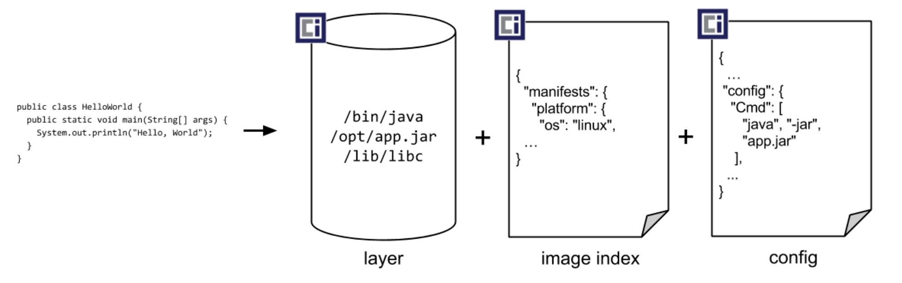

# Testcontainers

Presentasjon fagdag 25/10-2024
Sondre Eikanger Kvalø
@zapodot https://github.com/zapodot


---
<!-- 
header: 'Testcontainers'
footer: 'Fagdag SCB 25/10-2024'
-->

# Plan for timen
 1. Om testing
 1. Hvordan gjorde vi testing før?
 1. Testcontainers
 1. Konklusjon

---

### Hva menes med test?
>Kode som kjører som en del av standard bygging av et kodeprosjekt som tester ulike utfall som kan gjøres med produksjonskoden

---

### Noen ulike former for tester
- _enhetstest_ - tester en enkelt funksjon eller klasse. Fokus på f.eks grenseverdier. Mock-er alle avhengigheter
- _komponenttest_ - blackbox testing av en enkelt komponent. Mocker typisk alle eksterne komponenter
- _integrasjonstest_ - tester som fokuserer på grensesnittet mellom egen kode og tredjepart
<!-- 
Det finnes selvsagt mange andre typer tester f.eks sikkerhetstesting, ende-til-ende m.m
-->
---

### Hvordan gjorde vi dette før?
- Testet *ikke* integrasjonskode før produksjon
- Testet mot faktisk test/produksjonsmiljø
- Kjørte mocks/stubs som lot deg dekke en del av behovet (f.eks H2Database i kompabilitetsmodus)

---
### Eksempel: _enhetstest_
```java
@ExtendWith(MockitoExtension.class)
@SuppressWarnings("unchecked")
class RoleReadRepositoryTest {

    @Mock
    private NamedParameterJdbcOperations namedParameterJdbcOperations;

    @InjectMocks
    private RoleReadRepository roleReadRepository;

    @DisplayName("findById uten treff")
    @Test
    void findByIdWithoutResult() {
        when(namedParameterJdbcOperations.queryForObject(anyString(), anyMap(), isA(RowMapper.class)))
            .thenThrow(new IncorrectResultSizeDataAccessException(0));
        assertThat(roleReadRepository.findById(Long.MAX_VALUE)).isNull();
        verify(namedParameterJdbcOperations).queryForObject(anyString(), anyMap(), isA(RowMapper.class));
    }
```
---
### Vi trenger fortsatt _enhetstester_
 >Tester som fokuserer på en enkelt funksjon eller klasse ved bruk av mocks gir en pekepinn på om koden vår har rett nivå av avhengigheter (_coupling_).
 <!-- 
 Dersom vi må bruke mange mocks for å kjøre en test er det i seg selv en _code smell_
Dersom det er for mange avhengigheter som må mockes er det på tide å tenke på å refaktorere koden for å gjøre hver funksjon eller klasse lettere å teste.
Om vi bare kjører integrasjonstester er det lett å glemme dette aspektet
 -->

---
### Testcontainers
- Testcontainers gjør det enklere å kjøre containere for å teste som en del av standard bygging
- Kan kjøre en hvilken som helst container, men har egne moduler for mange ofte brukte containere (DBMS, meldingsbrokere etc) 
<!-- Finnes en haug med standardmoduler på https://testcontainers.com/modules/ -->
---


---
### Hva er en container?
[](https://github.com/opencontainers/image-spec/releases/download/v1.1.0/oci-image-spec-v1.1.0.pdf)
Kilde: *Open Container Initiative Image spec v 1.1.0*
<!--
OCI - specen definerer et image som summen av lag, index og config. Et container image skal kunne kjøre isolert og skal kun ha tilgang til bibliotek og kommandoer som er lagt inn i imaget 
-->


---
### Testcontainers 
>Testing med _Testcontainers_ er å anse som _integrasjonstester_ og fokuset bør først og fremst være på å sjekke at integrasjonskoden virker mot de tredjeparts avhengighetene vi har i produksjon

---
### Funksjonalitet
- Kan kjøre på 
    - Docker (Desktop)
    - Podman i med docker emulering
    - embedded runtime basert på Alpine Linux (eksperimentell)
    - _Testcontainers cloud_
---
### Kjøre containere i sky
- Trenger ikke ha en container runtime installert
- Pay-as-you-go modell
- Kanskje mest nyttig i CI-sammenheng?
- Etter at _Docker Inc_ kjøpte opp _Atomic Jar_ som laget _Testcontainers_ kan vi anta at det vil henge sammen med deres cloud-løsning
---
### Funksjonalitet
- Kan brukes fra ulike språk og med ulike testrammeverk, f.eks:
    - Java (_JUnit_ 4/5 eller _Spock_)
    - Kotlin (_kotest_)
    - .NET
    - Go
    - Node.js
    - m.fl

<!-- Siden Docker inc har kjøpt opp rettighetene til testcontainers er det rimelig å anta at de kommer til å bruke Docker Build Cloud på sikt -->
---
### Funksjonalitet 
- Kan kjøre alle containere
- Men: for en del mye brukte containere finnes det egne moduler som gjør jobben litt lettere
- For eksempel finnes det ferdige moduler for de fleste DBMS-systemer og de mest vanlige meldingssystemer
<!--
Å bruke disse ferdige modulene har noen fordeler. De tilbyr gjerne en enklere måte å konfigurere den spesifikke kontaineren på og de vet hvordan man kan vite at containeren er klar til bruk
-->
---
### Eksempel: generisk container 101
```kotlin
class GenericContainerTest : StringSpec({
    val genericContainer = GenericContainer("testcontainers/helloworld:1.1.0")
        .withExposedPorts(8080)
        .waitingFor(Wait.forHttp("/"))

    listeners(genericContainer.perTest())

    "Ping skal gi PONG" {
        val httpClient = HttpClient(CIO)
        httpClient.get("http://${genericContainer.host}:${genericContainer.getMappedPort(8080)}/ping")
            .asClue { response ->
                response.status.value shouldBe 200
                response.readBytes().toString(Charsets.UTF_8) shouldBe "PONG"
            }
    }
})
```
---
### Eksempel: Bruk av PostgresSQL modul med Java/JUnit 5
```java
@Testcontainers(disabledWithoutDocker = true)
public class ContainerBaseRepositoryTests {

    @Container
    private PostgreSQLContainer postgreSQLContainer = new PostgreSQLContainer("postgres:12.20-alpine");

    @Test
    void testnoemotdatabasen() {
        final var dataSourceConfig = new DataSourceConfig(
                postgreSQLContainer.getJdbcUrl(),
                postgreSQLContainer.getUsername(),
                postgreSQLContainer.getPassword()
        //...
    }

}
 ```
<!-- Viser i IDEA eksempel både for Java/JUnit 5 og Kotlin/kotest-->
---
### Eksempel: Bruk av PostgresSQL modul med  Kotlin/kotest
```kotlin 
class UserReadRepositoryTest : StringSpec({
    val postgres = PostgreSQLContainer("postgres:12.20-alpine")

    listeners(postgres.perSpec())

    "Test databasekode" {
        val exposedConnection = Database.connect(
            url = postgres.jdbcUrl,
            driver = postgres.driverClassName,
            user = postgres.username,
            password = postgres.password
        )
        //...
     }
})

```
---
### Eksempel: C# med xUnit 
```c#
public class PostgresDatabaseFixture : IAsyncLifetime
{
    private readonly PostgreSqlContainer _container =
        new PostgreSqlBuilder()
            .WithImage("postgres:12.20-alpine")
            .Build();

    public NpgsqlDataSource DataSource => new DataSourceFactory(_container.GetConnectionString()).Create();

    public Task InitializeAsync()
    {
        return _container.StartAsync().ContinueWith(t => RunMigrations());
    }
    
    public Task DisposeAsync()
        => _container.DisposeAsync().AsTask();
}
```
---

### Koble sammen containere (code smell?)
```java
try (
    Network network = Network.newNetwork();
    GenericContainer<?> foo = new GenericContainer<>(TestImages.TINY_IMAGE)
        .withNetwork(network)
        .withNetworkAliases("foo")
        .withCommand(
            "/bin/sh",
            "-c",
            "while true ; do printf 'HTTP/1.1 200 OK\\n\\nyay' | nc -l -p 8080; done"
        );
    GenericContainer<?> bar = new GenericContainer<>(TestImages.TINY_IMAGE)
        .withNetwork(network)
        .withCommand("top")
) {
    foo.start();
    bar.start();

    String response = bar.execInContainer("wget", "-O", "-", "http://foo:8080").getStdout();
    assertThat(response).as("received response").isEqualTo("yay");
}
```
---
### Fordeler ved å skrive tester som bruker testcontainers
- Får testet integrasjonskode mot noe som ligner veldig på det du bruker i produksjon
- Får testet kode som er strenger i kodebasen, f.eks SQL som kompilatoren ikke har et forhold til
---
### Ulemper med å ha tester som bruker testcontainers
- Tar lengre tid å kjøre testene
- Lett for at man ungår å refaktorere koden som integrerer mot tredjepart

---
### Konklusjon
- Tester som er avhengig av en tredjepart er ikke enhetstester men integrasjonstester
- Kan velge å skille ut testene som krever containere
- Enhetstester er fremdeles viktig for å sikre at man opprettholder så løs kobling som mulig

---
# Takk for meg :-)


